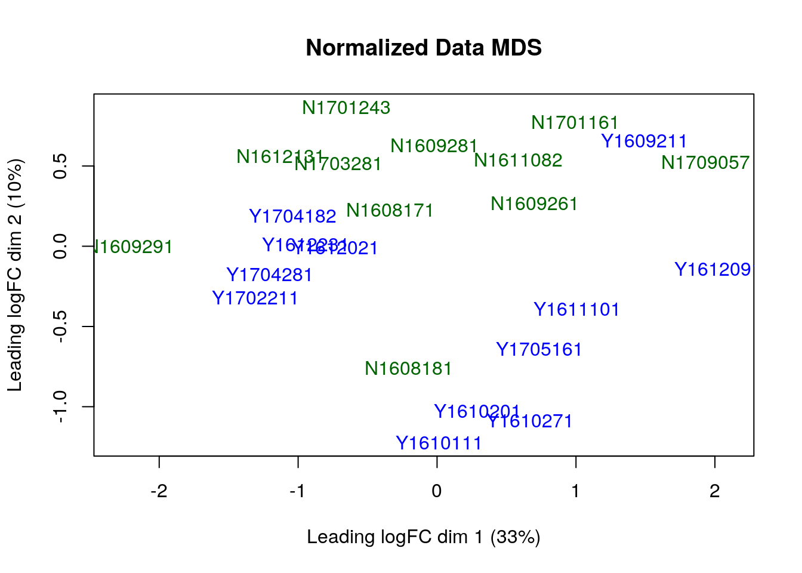

```{=html}
<style type="text/css">
  body{
  font-size: 12pt;
}
</style>
```
# Overview

## Primary Sjögren's syndrome(pSS)

-   Primary Sjögren's syndrome (pSS) is a chronic autoimmune disease that affects exocrine glands, such as the tear and saliva glands. The underlying cause of pSS is not fully understood, but it is thought to involve a combination of genetic and environmental factors that trigger an abnormal immune response [@luo2020transcriptome]. To understand the genetic cause of pSS, we focus on the transcriptomie analysis of exocrine glands from pSS and non-pSS patients.

## Patients and Data

-   As discussed, we selected [GSE159574](https://www.ncbi.nlm.nih.gov/geo/query/acc.cgi?acc=GSE159574) from the NCBI GEO database, which consists of RNA sequencing with salivary glands with 16 pSS patients and 13 non-pSS patients. Two subgroups both experienced the subjective clinical symptoms of xerostomia or xerophthalmia while pSS patients fulfill the clinical classification criteria of the pSS. The other group serves as the control for the experiment. The original publication for the dataset is [here](https://www.frontiersin.org/articles/10.3389/fcell.2020.592490/full) [@luo2020transcriptome].

## Data Processings

-   In the last assignment, we performed data cleaning and normalization on a gene expression dataset. This process involved removing low-quality samples, filtering out genes with low expression levels, and normalizing the remaining data to account for technical variability. After completing these steps, the final coverage of the dataset was `23` samples and `20394` genes. This means that we were left with high-quality data for 23 samples, each of which had expression measurements for `20394` genes.

# Setups

## Dependencies

-   We import the library for the study:

```{r message=FALSE, warning=FALSE}
if (!requireNamespace("kableExtra", quietly = TRUE)) {
    install.packages("kableExtra")
}
if (!requireNamespace("edgeR", quietly = TRUE)) {
    install.packages("edgeR")
}
if (!requireNamespace("ggplot2", quietly = TRUE)) {
    install.packages("ggplot2")
}
if (!requireNamespace("dplyr", quietly = TRUE)) {
    install.packages("dplyr")
}
if (!requireNamespace("gprofiler2", quietly = TRUE)) {
    install.packages("gprofiler2")
}
if (!requireNamespace("kableExtra", quietly = TRUE)) {
    install.packages("kableExtra")
}
if (!requireNamespace("ComplexHeatmap", quietly = TRUE)) {
    BiocManager::install("ComplexHeatmap")
}
if (!requireNamespace("circlize", quietly = TRUE)) {
    BiocManager::install("circlize")
}
if (!requireNamespace("Biobase", quietly = TRUE)) {
    BiocManager::install("Biobase")
}
if (!requireNamespace("EnhancedVolcano", quietly = TRUE)) {
    BiocManager::install("EnhancedVolcano")
}

library(edgeR)
library(ggplot2)
library(grid)
library(dplyr)
library(kableExtra)
library(ComplexHeatmap)
library(circlize)
library(Biobase)
library(EnhancedVolcano)
library(gprofiler2)
```

- edgeR: exprssion analysis [@robinson2010edger]
- ggplot2: plotting [@wickham2007ggplot]
- ComplexHeatmap: heatmap visualization [@gu2016complex]
- circlize: circular visualization [@gu2014circlize]
- EnhancedVolcano: Volvano plot [@blighe2020enhancedvolcano]
- gprofiler2: over-representation test  [@kolberg2020gprofiler2]


## Helper functions

- Plot normalized heat map

```{r}
#' Normalize and heatmapping the given dataset
#'
#' @param heatmap_matrix unnormalized dataset
#' @param filters 
#'
#' @return heatmap
#'
plot_normalized_heatmap <- function(heatmap_matrix){
  
  # Normalize the heatmap matrix
  heatmap_matrix <- heatmap_matrix[, order((colnames(heatmap_matrix)))]
  heatmap_matrix <- t(scale(t(heatmap_matrix)))
  
  # Setup the displays
  if(min(heatmap_matrix) == 0){
      heatmap_col = colorRamp2(c( 0, max(heatmap_matrix)), 
                        c( "white", "red"))
    } else {
      heatmap_col = colorRamp2(c(min(heatmap_matrix), 0,
          max(heatmap_matrix)), c("blue", "white", "red"))
    }
  
  # Display heatmap
  current_heatmap <- Heatmap(heatmap_matrix,
        show_row_dend = TRUE,show_column_dend = TRUE, 
        col=heatmap_col,show_column_names = TRUE, 
        show_row_names = FALSE,show_heatmap_legend = TRUE, use_raster=FALSE) 
  
  return(current_heatmap)
}
```

- Volcano plot

```{r}
#' Plot volcano plot with given de matrix
#'
#' @param dataset de matrix 
#'
#' @return volcano plot
#'
plot_volcano <- function(dataset){
  knitr::opts_chunk$set(fig.width=8, fig.height=4) 
  
  # prepare inputs
  sample_volcano <- data.frame(
    "HGNC_Symbol" = rownames(dataset),
    "LogFC" = dataset$logFC,
    "adj.P.Val" =dataset$FDR
  )
  
  # plot out volcano figure using Enchanced volcano
  EnhancedVolcano(sample_volcano,
    lab = sample_volcano$HGNC_Symbol,
    x = 'LogFC',
    pCutoff = 0.05,
    y = 'adj.P.Val',
    drawConnectors = TRUE,
    widthConnectors = 0.75,
    legendPosition = 'right',
    labSize = 3.0,
    legendLabSize = 12,
    title = "Differential Gene Experssion",
    subtitle = "adj.p-value cutoff = 0.05, log fold change cutoff=1",
    ylim = c(0,3)
  )
}
```

- Dot plot

```{r}
#' Plot out dot plot for over-representation test result visualization
#'
#' @param data ORT result
#'
#' @return dot plot
dotplot <- function(data){
  plot <- ggplot(data) + 
                  geom_point(aes(
                              x = precision, 
                              color = p_value,
                              y = term_name,
                              size = intersection_size)) +
                  theme(axis.title.x = element_text(size = 8),
                        axis.title.y = element_text(size = 8)) +
                 scale_color_gradient(low = "red", high = "blue") +
                  labs(x = "Perciesion",
                       color = "P-value", 
                       size = "Gene Intersection", 
                       y = NULL)
  return(plot)
}
```


## Load dataset

-   We retrieve the processed expression matrix and sample matrix from last assignment.

```{r}
DATA_SAVE_PATH <- "A2/final_expr_matrix.rds.re"
SAMPLE_SAVE_PATH <- "A2/sample_matrix.rds.re"

pSS_normalized_counts <- readRDS(DATA_SAVE_PATH)
sample_matrix <- readRDS(SAMPLE_SAVE_PATH)
```

```{r, echo=FALSE}
# extra processing
# pSS_normalized_counts <- log2(pSS_normalized_counts[!rownames(pSS_normalized_counts) == "", ])
# pSS_normalized_counts[which(!is.finite(pSS_normalized_counts))] <- 0
```

```{r}
knitr::kable(head(pSS_normalized_counts[,1:8]), format = "html") %>%
  kable_styling()
```

**Table 1.** Normalized expression matrix includes `23` samples and `20394` genes for total. Each observation uses HGNC symbol as identifier.

# Differential Gene Expression Analysis

## Expression EDAs

```{r}
plot_normalized_heatmap(pSS_normalized_counts)
```

**Figure 1.** The heatmap displays the entire expression profile of the samples in the dataset, with each row representing a gene and each column representing a sample. No clear clustering of samples based on expression values are shown.

-   As shown in [Figure 1.](Expression%20EDAs), whole there is no clear clustering of the samples based on expression values, the heatmap provides a visual representation of the relative expression levels of the genes across the samples.

## Model Design

### MDS plot

-   We refer to the multidimensional scaling (MDS) plot computed in the last assignment:

```{r echo=FALSE, out.width='100%'}

```

**Figure 2.** The MDS plot(blue: pSS, green: non-pSS) shows clustering of samples based on the pSS condition, with samples from pSS patients forming a distinct cluster from those of non-pSS patients.

### Quasi liklihood modelling

-   According to the MDS plot presented in [Figure 2](MDS%20plot), the samples in our dataset exhibited clustering based on the pSS condition and with some variability among patients. While we do not have multiple samples from the same patients, we will include only the pSS condition in constructing our model

-   While we have seen the over-dispersion in our dataset, we will use Quasi-likligood model to account that factor[@lund2012detecting]:

-   We build the model as described:

```{r}
samples <- data.frame(t(sample_matrix))
samples$patient <- as.factor(samples$patient)
model_design <- model.matrix( ~ samples$cond)
knitr::kable(head(model_design[,]), format = "html") %>%
  kable_styling()
```

**Table 2.** Model design specifications. The variables include pSS conditions.

-   Fit the described Quasi likelihood model:

```{r}
# Prepare inputs
dge = DGEList(counts=pSS_normalized_counts, group=sample_matrix$cond)
# Estimate dispersion
dge <- estimateDisp(dge, model_design)
# Fit the model
fit <- glmQLFit(dge, model_design)
```

-   Calculate the differential expression using the fitted model:

```{r}
qlf.pos_vs_neg <- glmQLFTest(fit, coef='samples$condY')
# calculate results
qlf_output_hits <- topTags(qlf.pos_vs_neg,sort.by = "PValue",
                           n = nrow(pSS_normalized_counts))
```

```{r, echo=FALSE}
qlf_output_hits$table <- qlf_output_hits$table[ rownames(qlf_output_hits$table) != c(".147"),]
```

## Differential Expression

-   We display the results:

```{r}
knitr::kable(head(qlf_output_hits$table), format = "html") %>%
  kable_styling()
```

**Table 3.** The table is sorted in descending order of PValues and provides information on Log fold change of expression (`LogFC`), log count per million (`logCPM`), F score (`F`), p value (`PValue`), and False Discovery Rate (`FDR`).

- Apply `0.05` thresholds on the p-values, we have `r length(which(qlf_output_hits$table$PValue < 0.05))` genes that are identified to be differentially expressed:

```{r}
length(which(qlf_output_hits$table$PValue < 0.05))
```

### Multiple Hypothesis Testing

```{r}
length(which(qlf_output_hits$table$FDR < 0.05))
```

- We used False Discovery Rate (FDR) for p-value correction [@si2013optimal]. FDR is a more recent development that determines adjusted p-values for each test. It controls the expected proportion of false positives among the rejected hypotheses. We chose this method because it is less conservative than other methods such as Bonferroni correction [@si2013optimal] as we previously discovered data quality issues. It allows us to detect more true discoveries specifically for Quasi likelihood model. After applying FDR correction, we found that `r  length(which(qlf_output_hits$table$FDR < 0.05))` genes passed the correction with an adjusted p-value of less than 0.05.

### Volcano Plot

```{r}
plot_volcano(qlf_output_hits$table)
```

**Figure 3.** The volcano plot shows the differentially expressed genes between the two conditions at an adjusted p-value cutoff of 0.05 and a log fold change cutoff of 1. Multiple up-regulated genes are identified while none of the down-regulated genes show significant differential expression at the specified cutoff.

- The volcano plot presented in [Figure 3](Volcano Plot) provides insights into the differentially expressed genes between the two conditions at an adjusted p-value cutoff of 0.05 and a log fold change cutoff of 1. It is clear from the plot that most of the differentially expressed genes are up-regulated, and none of the down-regulated genes show significant differential expression at the specified cutoff. This result suggests that the condition of interest may be associated with an overall increase in gene expression (e.g. `MS4A1`, `CXCL9`, ...). Interestingly, one gene, HLA-F, passed the adjusted p-value cutoff but failed the fold change threshold, indicating that it might be marginally associated with the condition. 

- Note that we have not identified any down-regulated genes, whereas the original publication did report a small number of them. Considering the ratio of down-regulated to up-regulated genes presented in the original publication being similar to ours,  this difference may be attributed to the original study employing an alternative statistical approach. Also we removed some outlier samples during prior processing steps, which may also have contributed to the difference in results.

### Heatmap for Siginificant Hits

- Compute the gene list for ones pass the threshold:

```{r}
sig_list <- rownames(qlf_output_hits[qlf_output_hits$table$FDR <= 0.05,])
up_list <- rownames(qlf_output_hits[qlf_output_hits$table$FDR <= 0.05,])
```

- Plot the heatmap:

```{r}
# filter the heatmap
sig_heatmap_matrix <- pSS_normalized_counts[rownames(pSS_normalized_counts) 
                                            %in% unlist(sig_list),]
plot_normalized_heatmap(sig_heatmap_matrix)
```

**Figure 4.** The heatmap displays the gene expression levels of the significant genes that have changed between the pSS and non-pSS conditions. The heatmap illustrates the clustering of the samples based on their pSS conditions, with the samples from the pSS condition exhibiting more up-regulated genes than the samples from the non-pSS condition. 

- As shown in [Figure 4](Heatmap for Siginificant Hits), the heatmap provides a visual representation of clustering of pSS and non-pSS samples where the samples from the pSS condition exhibiting more up-regulated genes than the samples from the non-pSS condition. This result indicates that the pSS condition may be associated with significant changes in gene expression patterns compared to the non-pSS condition.


# Thresholded Over-representation Analysis

- While we fail to identify the genes with significant down-regulation, we will run two enrichment tests separately on:  p-value thresholded list of up-regulated genes and fold-change thresholded list of down-regulated genes. We will use g:Prolier for functional mapping [@raudvere2019g].


## Up-regulated genes

<!-- - We extract the list with threshold of adjusted p-value below 0.05, this gene list consists of `r length(which(qlf_output_hits$table$FDR < 0.05))` genes: -->

<!-- ```{r, message=FALSE} -->
<!-- sink("A2/up_list.txt"); writeLines(unlist(lapply(sig_list, paste, -->
<!--                                                  collapse=" "))); sink() -->
<!-- ``` -->

```{r}
gostres <- gost(query = sig_list, 
                organism = "hsapiens", ordered_query = FALSE, 
                multi_query = FALSE, significant = TRUE, exclude_iea = FALSE, 
                measure_underrepresentation = FALSE, evcodes = FALSE, 
                user_threshold = 0.05, correction_method = "fdr", 
                domain_scope = "annotated", custom_bg = NULL, 
                numeric_ns = "", sources = NULL, as_short_link = FALSE)
gostres$result$query <- "Up-Regulated Genes"
gostplot(gostres, interactive = F, )
```

**Figure 5.** The figure displays up-regulated thresholded gene list, where multiple significant pathways that were identified using various databases.

- We focus on the `GO:BP` database [@mi2019panther] for enrichment analysis:

```{r}
gobp <- gostres$result[gostres$result$source == "GO:BP", ]

```

- There are `r sum(gobp$significant==TRUE)` significant pathways.

```{r}
dotplot(gobp[1:10,])
```

**Figure 6.** The Dot plot displays the over-representation test results for 10 significant hits in up-regulated thresholded gene list.

- As shown in the over-representation test [Figure 6.](Up-regulated genes), the most enriched biological pathways are related to the immune system, which is expected as pSS is an autoimmune disease that affects exocrine glands. The upregulation of immune-related genes suggests that there is an abnormal immune response in patients with pSS, which may contribute to the inflammation and tissue damage seen in the disease. Also, antigen processing and peptide signallings are also shown here and related immnue pathway.


## Down-regulated genes

- As no down-regulated genes are identified as significant in our pipeline, we threshold select the top `r length(which(qlf_output_hits$table$FDR < 0.05))` genes on fold changes (to align with our `r length(which(qlf_output_hits$table$FDR < 0.05))` significant genes identified for up regulation).

```{r}
sig_list <- rownames(head(qlf_output_hits[order(qlf_output_hits$table$logFC),],
                          length(which(qlf_output_hits$table$FDR < 0.05))))
down_list <- sig_list
```

```{r}
gostres <- gost(query = sig_list, 
                organism = "hsapiens", ordered_query = FALSE, 
                multi_query = FALSE, significant = TRUE, exclude_iea = FALSE, 
                measure_underrepresentation = FALSE, evcodes = FALSE, 
                user_threshold = 0.05, correction_method = "fdr", 
                domain_scope = "annotated", custom_bg = NULL, 
                numeric_ns = "", sources = NULL, as_short_link = FALSE)
gostres$result$query <- "Down-Regulated Genes"
gostplot(gostres, interactive = F, )
```

**Figure 7.** The figure displays down-regulated thresholded gene list, where multiple significant pathways that were identified using various databases.

- We focus on the `GO:BP` database [@mi2019panther] for enrichment analysis:

```{r}
gobp <- gostres$result[gostres$result$source == "GO:BP", ]

```

- There are `r sum(gobp$significant==TRUE)` significant pathways.

```{r}
dotplot(gobp[1:10,])
```

**Figure 8.** The Dot plot displays the over-representation test results for 10 significant hits in down-regulated thresholded gene list.

- The analysis of down-regulated genes presented in [Figure 8](Down-regulated genes) revealed the association of several immune pathways with the condition of interest. Although the specificities are not very high, this result indicates that the down-regulation of immune pathways might play a crucial role in the pathogenesis of the condition. Interestingly, the pathway analysis also identified tear secretion, which is a known symptom of pSS. The down-regulation of genes associated with tear secretion suggests that the condition may be associated with the dysfunction of the exocrine gland, leading to decreased tear production and resulting in xerostomia [@luo2020transcriptome]. 

## Combined Study

- In this section, we explore whether the combination of up- and down-regulated genes collectively contribute to significant pathways implicated in the development of pSS. To do this, we perform an enrichment test using the up-regulated genes identified through a p-value threshold and the down-regulated genes selected based on a log fold change threshold. 

```{r}
c_list <- c(up_list , down_list)
```


```{r}
gostres <- gost(query = c_list, 
                organism = "hsapiens", ordered_query = FALSE, 
                multi_query = FALSE, significant = TRUE, exclude_iea = FALSE, 
                measure_underrepresentation = FALSE, evcodes = FALSE, 
                user_threshold = 0.05, correction_method = "fdr", 
                domain_scope = "annotated", custom_bg = NULL, 
                numeric_ns = "", sources = NULL, as_short_link = FALSE)
gostres$result$query <- "Thresholded Genes"
gostplot(gostres, interactive = F, )
```

**Figure 9.** The figure displays combined  gene list, where multiple significant pathways that were identified using various databases.

- We focus on the `GO:BP` database [@mi2019panther] for enrichment analysis:

```{r}
gobp <- gostres$result[gostres$result$source == "GO:BP", ]

```

- There are `r sum(gobp$significant==TRUE)` significant pathways.

```{r}
dotplot(gobp[1:10,])
```

**Figure 10.** The Dot plot displays the over-representation test results for 10 significant hits in combined gene list.


- The combined study Dot plot  [Figure 10](Combined Study) analysis reveals a significant enrichment in immune pathways, similar to the results observed in the test focusing on up-regulated genes. This finding is consistent with the proposed mechanism underlying pSS, which is widely recognized as an autoimmune disease. The enrichment in immune pathways supports the notion that dysregulation of the immune system is a critical factor in the pathogenesis of pSS. These similarities between the Dot plot and up-regulated gene tests further emphasize the crucial role that immune processes play in the development and progression of this complex autoimmune disorder.


# Interpretation

- Note this section is an summary and extension of the previously discussed materials

## Differntial Gene Expression

- Calculate p-values for each of the genes in your expression set. How many genes were significantly differentially expressed? What thresholds did you use and why?

> As discussed [here](Differential Expression), we have identified `r length(which(qlf_output_hits$table$PValue < 0.05))` genes that are significantly differentially expressed between pSS and healthy controls. We used a p-value threshold of 0.05 to identify these genes.

- Multiple hypothesis testing - correct your p-values using a multiple hypothesis correction method. Which method did you use? And Why? How many genes passed correction?

> As discussed [here](Differential Expression), we used False Discovery Rate (FDR) for p-value correction [@si2013optimal]. FDR is a more recent development that determines adjusted p-values for each test. It controls the expected proportion of false positives among the rejected hypotheses. We chose this method because it is less conservative than other methods such as Bonferroni correction [@si2013optimal] as we previously discovered data quality issues. It allows us to detect more true discoveries specifically for Quasi likelihood model. After applying FDR correction, we found that `r  length(which(qlf_output_hits$table$FDR < 0.05))` genes passed the correction with an adjusted p-value of less than 0.05.

- Heatmap and Volcano plot
  
> Please see [here](Differential Expression) for the heatmap and volcano plot.
> The samples are clustered together by up-regulated genes by heatmaps and volcano plot identifies multiple up-regulated genes.


## Thresholded Over-representation Test

- Which method did you choose and why?
  
> Since we have no significantly down-regulated genes in our dataset, we threshold select the down-regulated genes based on log fold changes. We choose the up-regulated genes based on adjusted p-value. Also, we have a concatenated list of up- and down-regulated genes. We use the combined list to perform the over-representation test. The gene lists are sent to g:Profiler [@kolberg2020gprofiler2] to perform the over-representation test. 

- What annotation data did you use and why? What version of the annotation are you using?

> We used the multiple annotation data (e.g. `GO`, `KEGG`, ...) to perform the over-representation test. We used the latest version(e108_eg55_p17_0254fbf) of the annotation data. On the enrichment test, we used the `GO:BP` [@mi2019panther] annotation data to perform case study on enriched pathways.

- How many genesets were returned with what thresholds?

> We used a p-value threshold of 0.05 to identify significant pathways.
> Up-regulated genes: 270 significant pathways.
> Down-regulated genes: 20 significant pathways.
> Combined: 240 significant pathways.


- Combined list vs. Up- / Down- regulated list

> The combined list has more significant pathways than the up- and down-regulated list while intersecting with the up-regulated pathway a lot. All three results point out the immune pathways are significantly enriched in pSS.


## Overall Interpretation

- Do the over-representation results support conclusions or mechanism discussed in the original paper?

> The over-representation results support the conclusions and mechanism discussed in the original paper [@luo2020transcriptome]. The original paper discussed the pSS is an autoimmune disease, and the over-representation results also point out the immune pathways are significantly enriched in pSS. The original paper also discussed the lack of tear secretion is a known symptom of pSS, and the over-representation results also point out the tear secretion is down-regulated. Moreover, he significantly expressed genes mostly intersect with the analysis results from the original paper, e.g., `MS4A1`.

- Can you find evidence, i.e. publications, to support some of the results that you see. How does this evidence support your results.

> As per the up-regulated genes, one of the enriched pathways is the peptide signaling pathway discussed [here](Up-regulaterd Genes). Research conducted earlier has found that the development of pSS is associated with a dysfunction in the Toll-like receptor (TLR) signaling mechanism [@routsias2010autoimmune]. TLR is an important component of the peptide signaling pathway [@kwon2019cell]. This finding strengthens the conclusion that the peptide signaling pathway is enriched in pSS.

# References
