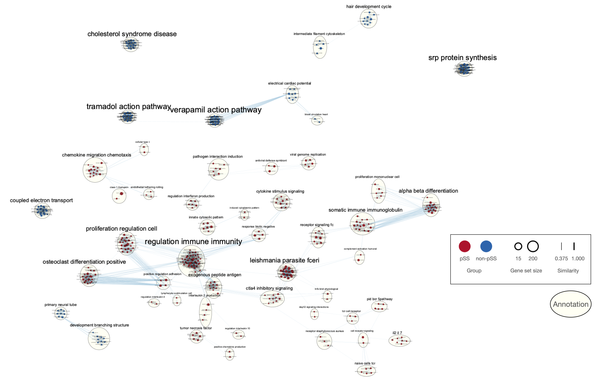

```{=html}
<style type="text/css">
  body{
  font-size: 12pt;
}
</style>
```
# Overview

## Primary Sjögren's syndrome(pSS)

-   Primary Sjögren's syndrome (pSS) is a chronic autoimmune disease that affects exocrine glands, such as the tear and saliva glands. The underlying cause of pSS is not fully understood, but it is thought to involve a combination of genetic and environmental factors that trigger an abnormal immune response [@luo2020transcriptome]. To understand the genetic cause of pSS, we focus on the transcriptomie analysis of exocrine glands from pSS and non-pSS patients.

## Patients and Data

-   As discussed, we selected [GSE159574](https://www.ncbi.nlm.nih.gov/geo/query/acc.cgi?acc=GSE159574) from the NCBI GEO database, which consists of RNA sequencing with salivary glands with 16 pSS patients and 13 non-pSS patients. Two subgroups both experienced the subjective clinical symptoms of xerostomia or xerophthalmia while pSS patients fulfill the clinical classification criteria of the pSS. The other group serves as the control for the experiment. The original publication for the dataset is [here](https://www.frontiersin.org/articles/10.3389/fcell.2020.592490/full) [@luo2020transcriptome].

## Data Processings

-   In Assignment 1, we performed data cleaning and normalization on a gene expression dataset. This process involved removing low-quality samples, filtering out genes with low expression levels, and normalizing the remaining data to account for technical variability. After completing these steps, the final coverage of the dataset was `23` samples and `20394` genes. This means that we were left with high-quality data for 23 samples, each of which had expression measurements for `20394` genes.

## Differential Gene Expression Analysis

- In assignment 2, we conducted a differential gene expression analysis to compare the gene expression profiles of primary Sjögren's Syndrome (pSS) patients to those of the non-pSS group. The results of this analysis provided us with a ranked gene list covering all the genes using `logFC`, log fold change . This ranked list has been stored in the file `./A3/pSS.rnk` for further investigation in this assignment. 
  
# Setups

## Dependencies
```{r}
library(ggplot2) #ploting
library(stringr) #string processing
```


## Helper Functions

- We prepare the function for plotting the enrichment results.

```{r}
#' Plot out dot plot for enrichment analysis results
#'
#' @param data enrichment result
#'
#' @return dot plot
dotplot <- function(data){
  plot <- ggplot(data) + 
                  geom_point(aes(
                              x = es, 
                              color = FDR,
                              y = term_name,
                              size = size)) +
                  theme(axis.title.x = element_text(size = 8),
                        axis.title.y = element_text(size = 8)) +
                 scale_color_gradient(low = "red", high = "blue") +
                  labs(x = "Enrichment Score(ES)",
                       color = "FDR", 
                       size = "Geneset Size", 
                       y = NULL)
  return(plot)
}
```


# Non-thresholded Gene Set Enrichment Analysis


## Method

- In our next step, we will employ Gene Set Enrichment Analysis (GSEA) [@subramanian2005gene; @mootha2003pgc]  using the Bader Lab gene set [@GeneSets] for humans to further investigate the biological pathways and processes that may be impacted in pSS group vs. non-pSS group. This analysis will be conducted using `GSEA` mac software version `4.3.2`, a well-established and widely-used computational method to identify and interpret the functional context of differentially expressed genes. The Bader Lab gene set, known for its comprehensive and up-to-date collection of gene sets, will be utilized in its most recent release dated `March 2, 2023`, ensuring that our analysis is based on the latest available knowledge. 

## Enrichment Result

- We load the pre-computed results (more information available in Journal):

```{r}
pos_path <- "./A3/gsea_report_for_pos_pSS.tsv"
neg_path <- "./A3/gsea_report_for_neg_pSS.tsv"

pos_enrich <- read.table(file = pos_path, sep = '\t', header = TRUE, fill = TRUE)
neg_enrich <- read.table(file = neg_path, sep = '\t', header = TRUE, fill = TRUE)
```


- Identified 1067 genesets with statistical significance (FDR < 0.25) enriched in pSS group and 1145 genesets enriched in non-pSS group. We visualize the enrichment results in dot plot (we select the most statistically significant ones on FDR):


- Enrichment in pSS group:
```{r}
# perpare the input
pos_package <- data.frame(
  term_name = str_wrap(sub("\\%.*", "", pos_enrich$NAME), 20), # truncate %
  size = pos_enrich$SIZE,
  FDR = pos_enrich$FDR.q.val,
  es = pos_enrich$ES
)

# plot
dotplot(pos_package[1:10,])
```

**Figure 1.** The Dot plot displays the GSEA results for 10 significant hits in enriched genes for pSS group.


- Enrichment in non-pSS group:
```{r}
# prepare the input
neg_package <- data.frame(
  term_name = str_wrap(sub("\\%.*", "", neg_enrich$NAME), 20), # truncate %
  size = neg_enrich$SIZE,
  FDR = neg_enrich$FDR.q.val,
  es = neg_enrich$ES
)

# plot
dotplot(neg_package[1:10,])
```

**Figure 2.** The Dot plot displays the GSEA results for 10 significant hits in enriched genes for non-pSS group.

- [Figure 1](Enrichment Result) and [Figure 2](Enrichment Result) provide a clear visual representation of our GSEA results through the use of informative dot plots. It is important to emphasize that all the results presented are statistically significant. The main gene sets enriched in the pSS group are primarily related to immune response, interferon response, and allograft rejection, which is consistent with the established understanding of pSS as an autoimmune disease [@luo2020transcriptome]. In contrast, the non-pSS group displays enrichment in gene sets involved in cell development and protein synthesis, particularly for immune-response related protein synthesis.


## Comparison with ORA

- We pull the results from ORA analysis from A2:
  <!-- - Up-regulated genes for pSS condition: -->
  <!--   - response to other organism -->
  <!--   - response to external biotic stimulus  -->
  <!--   - response to biotic stimulus -->
  <!--   - immune system process  -->
  <!--   - immune response  -->
  <!--   - antigen processing and presentation of peptide antigen via MHC class I -->
  <!--   - antigen processing and presentation of peptide antigen  -->
  <!--   - antigen processing and presentation of endogenous peptide antigen  -->
  <!--   - antigen processing and presentation of endogenous antigen  -->
  <!--   - antigen processing and presentation  -->
  <!-- - Down-regulated genes for pSS condition: -->
  <!--   - tear secretion  -->
  <!--   - response to lipopolysaccharide  -->
  <!--   - regulation of epithelial cell proliferation - -->
  <!--   - organ or tissue specific immune response -->
  <!--   - neutrophil aggregation - -->
  <!--   - mucosal immune response. -->
  <!--   - intermediate filament organization  -->
  <!--   - intermediate filament cvtoskeleton organization  -->
  <!--   - innate immune response in mucosa  -->
  <!--   - epithelial cell proliferation -->
  
  | Up-regulated Genes                                                     | Down-regulated Genes                            |
  |------------------------------------------------------------------------|-------------------------------------------------|
  | response to other organism                                             | tear secretion                                  |
  | response to external biotic stimulus                                   | response to lipopolysaccharide                  |
  | response to biotic stimulus                                            | regulation of epithelial cell proliferation     |
  | immune system process                                                  | organ or tissue specific immune response        |
  | immune response                                                        | neutrophil aggregation                          |
  | antigen processing and presentation of peptide antigen via MHC class I | mucosal immune response.                        |
  | antigen processing and presentation of peptide antigen                 | intermediate filament organization              |
  | antigen processing and presentation of endogenous peptide antigen      | intermediate filament cvtoskeleton organization |
  | antigen processing and presentation of endogenous antigen              | innate immune response in mucosa                |
  | antigen processing and presentation                                    | epithelial cell proliferation                   |

**Table 1.** ORA results from A2 for up-regulated genes and down-regulated genes for pSS condition.

- By comparing the GSEA results ([Figure 1](Enrichment Result) and [Figure 2](Enrichment Result)) and the ORA result ([Table 1](Comparison with ORA)), the enriched gene sets identified by two distinct analytical methods, demonstrate a strong alignment and consistency in their findings. Both methods reveal significant enrichment in immune response-related gene sets, further substantiating the well-established autoimmune nature of pSS[@luo2020transcriptome]. On the other hand, for the non-pSS group, the ORA indicates enrichment in cell proliferation, which can be linked to the cell development and protein synthesis gene sets identified in the GSEA results. 

- However, the comparison is not straightforward. This is primarily due to the fact that the gene sets used in each method are not identical. In the GSEA analysis, we utilized the BaderLab curated gene sets [@GeneSets], which are curated from multiple sources, whereas in the ORA analysis, we only covered Gene Ontology Biological Process (GO:BP) gene sets [@mi2019panther]. As a result, the conclusions we have drawn are based on a qualitative comparison of gene set names rather than a rigorous quantitative analysis. 


# Visualization in Cytoscape

## Graph construction


**Figure 3.** Enrichment map showing pSS vs. non-pSS with threshold FDR at 0.01.


- We use Cytoscape[@Shannon2003CytoscapeAS] and its EnrichmentMap[@Merico2010EnrichmentMA] app to construct the enrichment map for further analysis. We determined the node threshold based on empirical experience. At a false discovery rate (FDR) of 0.05, the graph includes more than 1,000 gene sets, which poses challenges for downstream analysis. We then further reduced the threshold to an FDR of `0.01`, effectively limiting the number of gene sets to 745 and edge counts to 5,914, as illustrated in [Figure 3](Graph construction). The edge is constructed using the default algorithm which the edge value is weighted eqaully by Jaccard and overlaps. Edge values lower than `0.375` are filtered out.


## Network Annotation

**Figure 4.** Annotated enrichment map showing the clustered genesets.

- We then use `AutoAnnotate` app[@autoannotate] to construct the annotation after manual adjustment discussed in Journal. MCL clustering algorithm in the app [@autoannotate] is used to show the common labels among nodes. For the labels, we have max word per label leaving default at 3 and minimum word occurrence at 1. 

- As shown in [Figure 4](Network Annotation), the analysis of enriched gene sets for pSS samples has identified the regulation of immune response as the most common theme. Additionally, some cell differentiation and proliferation keywords have emerged in our findings, highlighting other potential molecular mechanisms at play in pSS. In contrast, for non-pSS groups, our results show enrichment in gene sets related to protein synthesis and cell structure.

## Collapsed network of major biological themes


**Figure 5.** Collapsed theme network reflecting the enriched gene sets for pSS groups.

- As shown in [Figure 5](Network Annotation), we used `AutoAnnotate` app[@autoannotate] to construct a summary network for the annotated graph. The major themes are consistent with the observation before, including regulation of immune response, cell differentiation and proliferation for pSS group. Some protein synthesis and cell structure themes are related to non-pSS groups.

- The results fit our proposed model and major findings in the original publication[@luo2020transcriptome], e.g. identification of Immuno response. Interestingly, we identified more themes related with skin, cell structure and differentiation than our expectations. Further investigation is needed to determine the relationship between these molecular landscapes to pSS.


# Post analysis

## Transcription factor signiture study

- Increasing evidence suggests that pSS may be associated with inheritable factors, and multiple publications have identified potential risk factors linked to mutations in transcription factors [@imgenberg2021genetics]. To further explore this relationship, we performed a post-analysis (signature gene set analysis) with the aim of identifying enriched transcription factors associated with our findings.

- For this purpose, we used the signature gene set of Transcription Factors from Bader Lab[@GeneSets], utilizing their latest released version from March 2, 2023. To compute the graph, we employed the `EnrichmentMap` app[@autoannotate] and applied a two-sided Mann-Whitney test to set the threshold at a p-value of 0.05. This allowed us to identify and showcase three selected signature sets as demonstrative examples of the transcription factors potentially implicated in pSS. These transcription factor signature sets are shown in table [Table 2](Transcription factor signiture study):

  | Signiture TFs                                                          |
  |------------------------------------------------------------------------|
  | IRF5                                             |
  | STAT4                                   |
  | ATF4                                            |
  
**Table 2.** Selected transcription factor genesets for post-analysis.

  
## Post-analysis results


**Figure 6.** Selected Transcription Factor signature genesets. (A) `STAT4` interacts with multiple immune response genesets. (B) `IRF5` is related to protein biosynthesis and cell development. (C) `ATF4` enriches to infection signalling pathway.


-  As shown in [Figure 6](Post-analysis results), we closely examined three transcription factor gene sets: `STAT4`, `IRF5`, and `ATF4.` `STAT4` is associated with multiple immune response gene sets, while `IRF5` is related to protein synthesis and cell development. Notably, both of these transcription factors have been reported as risk factors for pSS [@imgenberg2021genetics]. `IRF5`, in particular, is a transcription factor that operates downstream of toll-like receptors (TLRs) and type I IFN receptors, promoting the expression of numerous antiviral and pro-inflammatory proteins[@takaoka2005integral]. Meanwhile, `STAT4` is involved in activating the downstream immunomodulatory cytokine secretion[@nordmark2009additive]. Our findings align with the known roles of these transcription factors in pSS.

- However, to the best of our knowledge, `ATF4` has not been reported in any articles related to `pSS.` `ATF4` is known to mediate programmed cell death by promoting the expression of genes involved in cellular amino acid metabolic processes, mRNA translation, and the terminal unfolded protein response [@ohoka2005trb3]. This suggests that `ATF4` plays a role in stress response. Intriguingly, the gene is primarily located on the X chromosome [@ohoka2005trb3], and given pSS's high odds in females (16 females : 1 male) [@imgenberg2021genetics], this may imply a potential role for `ATF4` in pSS pathogenesis. Nevertheless, further investigation is needed to confirm these preliminary observations and to fully understand the role of `ATF4` in the context


# Interpretation

- Do the enrichment results support conclusions or mechanism discussed in the original paper? How do these results differ from the results you got from Assignment #2 thresholded methods

> Our enrichment results lend support to the conclusions and mechanisms discussed in the original paper [@luo2020transcriptome]. The original paper described pSS as an autoimmune disease, and our findings further emphasize the significant enrichment of immune response in the pSS group. Several other pathogenesis features align with the original paper as well, such as the enrichment of the lymphocytic infiltration gene set and the identification of immune-response-related protein synthesis.
> When comparing our results with the ORA from the previous assignment, we find that the majority of enrichments are consistent between the two methods, with the exception of pathways in non-pSS groups. The ORA suggests that some pathways enriched in non-pSS groups are related to tear secretion, which is not fully captured in our non-thresholded method. One possible explanation for this discrepancy is that we utilized a more comprehensive and curated gene set from Bader Lab [@GeneSets] in our analysis, allowing us to explore the pathogenesis at a higher resolution. 

- Can you find evidence, i.e. publications, to support some of the results that you see. How does this evidence support your result?

> We would like to highlight a novel finding from our post-analysis ([here](Post analysis)), which identified a novel transcription factor, `ATF4`, as being associated with enriched gene sets in pSS, even though it has not been reported in previous pSS studies to the best of our knowledge.
> Transcription factor `ATF4` is known to mediate programmed cell death by promoting the expression of genes involved in cellular amino acid metabolic processes, mRNA translation, and the terminal unfolded protein response [@ohoka2005trb3]. This function aligns with the immune response mechanism of pSS.
> Additionally, `ATF4` has multiple gene replications located on the X chromosome. The X chromosome has been proposed as a promising candidate for involvement in pSS pathogenesis, as the study by Imgenberg et al. [@imgenberg2021genetics] reported a higher risk for females, with a male-to-female ratio of 1:16. This skewed prevalence suggests a potential connection between the X chromosome and the development of pSS.
> Taking these factors into account, it may suggest that `ATF4`, with its roles in cellular processes and location on the X chromosome, may have a potential pathogenic role in pSS. Further investigation is necessary to confirm this hypothesis and elucidate the precise mechanisms through which `ATF4` dysfunction might contribute to the development of pSS.

- Post analysis notes can be found [here](Post analysis)

# References
